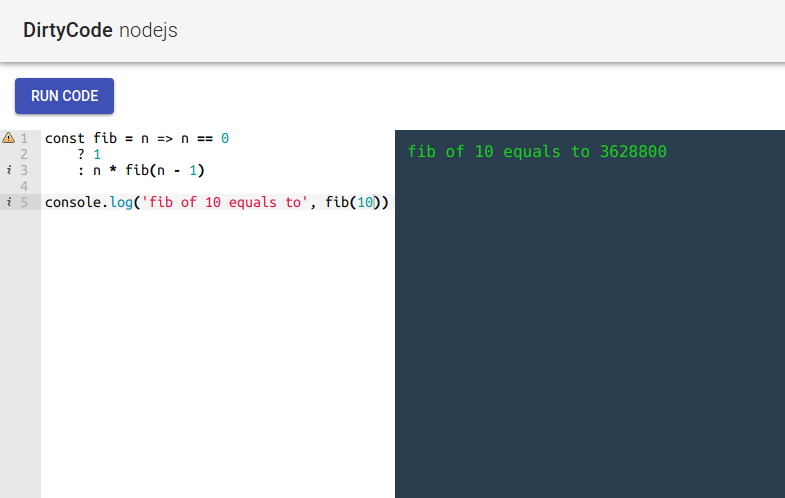

# DirtyCode

Small programming sandbox. User's code runs in docker containers on backend.

## How to install locally

1. Run `prepare.sh`. It will build required docker images.
2. Run `npm i` to install back-end deps.
3. Run `npm i && npm start` in `client/` directory to install front-end deps and build front-end.
4. Run `npm start` in root dir to serve the front-end and start a server.

## Learn more about untrusted code isolation:

- https://www.software.ac.uk/blog/2017-11-23-executing-python-code-submitted-web-service
- https://security.stackexchange.com/questions/107850/docker-as-a-sandbox-for-untrusted-code
